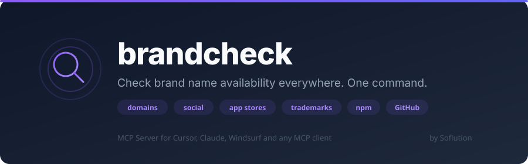

<p align="center">
  
</p>
<p align="center">
  <strong>Check brand name availability everywhere. One command.</strong><br>
  <sub>Domains · Social Media · App Stores · Trademarks · Dev Platforms</sub>
</p>
<p align="center">
  
  
  
  
</p>
<p align="center">
  <a href="cursor://anysphere.cursor-deeplink/mcp/install?name=brandcheck&config=eyJ0eXBlIjoic3RkaW8iLCJjb21tYW5kIjoibnB4IiwiYXJncyI6WyIteSIsImJyYW5kY2hlY2tAbGF0ZXN0Il19"></a>
  &nbsp;&nbsp;
  <a href="https://soflution1.github.io/BrandCheck/install.html?name=brandcheck&config=eyJ0eXBlIjoic3RkaW8iLCJjb21tYW5kIjoibnB4IiwiYXJncyI6WyIteSIsImJyYW5kY2hlY2tAbGF0ZXN0Il19"></a>
</p>

---

## What it checks

| Category | Platforms |
|----------|-----------|
| 🌐 **Domains** | `.com` `.fr` `.io` `.co` `.app` `.ai` `.dev` `.org` `.net` `.eu` |
| 📱 **Social** | X · Instagram · TikTok · LinkedIn · Facebook · YouTube · Threads · Pinterest · Reddit · Snapchat · Bluesky |
| 📲 **App Stores** | Apple App Store · Google Play |
| ⚖️ **Trademarks** | INPI (French trademark registry) |
| 💻 **Tech** | npm · GitHub |

**27 platforms checked in parallel.** Results in ~5 seconds.

---

## Quick Start

### Option 1: Cursor (one-click)

Click the **"Install MCP Server"** button above. Done.

### Option 2: Manual (any MCP client)

Add to your MCP config (`~/.cursor/mcp.json`, Claude Desktop, etc.):

```json
{
  "mcpServers": {
    "brandcheck": {
      "command": "npx",
      "args": ["-y", "brandcheck@latest"]
    }
  }
}
```

### Option 3: npx (zero install)

```bash
npx brandcheck@latest
```

---

## Tools

### `brandcheck`

Full audit across all platforms. One command, everything in parallel.

```
"Check if the name Luminova is available"
```

Returns a complete report with availability status per platform, recommendations on .com/.fr availability, and INPI trademark warnings.

### `brandcheck_domains`

Domain-only check. Fast.

```
"Check domains for roompilot"
```

### `brandcheck_social`

Social media handles only.

```
"Is the handle clickstay available on social media?"
```

---

## Example Output

```
🔍 Brand Check: "luminova"

Résumé: ✅ 18 dispo · ❌ 7 pris · ❓ 2 incertain

🌐 Noms de domaine
| .com  | ❌ Pris  | https://luminova.com  |
| .fr   | ✅ Dispo | https://luminova.fr   |
| .io   | ✅ Dispo | https://luminova.io   |
| .ai   | ✅ Dispo | https://luminova.ai   |

📱 Réseaux sociaux
| Instagram | ❌ Pris  | https://instagram.com/luminova |
| TikTok    | ✅ Dispo | https://tiktok.com/@luminova   |
| LinkedIn  | ✅ Dispo | https://linkedin.com/company/luminova |

💡 Recommandation
⚠️ Le .com est pris mais le .fr est dispo.
✅ Aucune marque identique trouvée à l'INPI.
```

---

## How it works

All checks run **in parallel**:
- **Domains**: DNS resolution (no WHOIS API needed)
- **Social media**: HTTP HEAD/GET requests checking for 404 vs 200
- **App Store**: iTunes Search API
- **Google Play**: HTML scraping
- **INPI**: Public data API
- **npm/GitHub**: Registry and profile checks

**No API keys required.** Everything uses public endpoints.

---

## Limitations

- Social media checks rely on HTTP status codes. Some platforms may rate-limit or return ambiguous results (shown as ❓).
- INPI check is a basic name search, not a full trademark similarity analysis. Always consult a lawyer before filing.
- App Store results are keyword-based. A "no exact match" doesn't guarantee the name is available for submission.

---

## Also by Soflution

- **[depsonar](https://github.com/Soflution1/depsonar)** — The most complete dependency audit MCP server. 9 languages, 23 tools. Scan, audit, update, migrate.

---

## License

MIT
